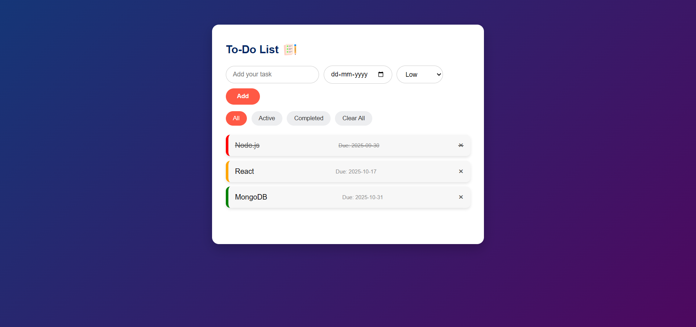

# 📝 To-Do List App

A modern, responsive **To-Do List Application** built with **HTML, CSS, and JavaScript**.  
This app allows users to create, organize, and manage daily tasks with features like **priority levels, due dates, filters, drag-and-drop sorting, and local storage persistence**.  

---

## 🚀 Features
- ✅ Add tasks with **priority levels** (Low / Medium / High)  
- ✅ Set **due dates** (overdue tasks auto-highlighted in red)  
- ✅ Mark tasks as **completed** (line-through + gray styling)  
- ✅ **Filter tasks** → All | Active | Completed  
- ✅ **Drag & Drop** → reorder tasks with smooth animations  
- ✅ **LocalStorage support** → tasks stay saved even after page refresh  
- ✅ Clear All tasks button  
- ✅ Fully **responsive design** with modern UI  

---

## 🖥️ Tech Stack
- **HTML5** → Semantic structure  
- **CSS3** → Modern responsive design, animations, priority indicators  
- **JavaScript (ES6+)** → Task management, localStorage, drag-and-drop  

---

## 📸 Screenshots

### 🏠 Home Page


---

## ⚡ Installation & Usage

1. **Clone this repo**
   ```bash
   git clone [https://github.com/your-username/todo-app.git](https://github.com/akhilBharti510/To-Do-List-App)
